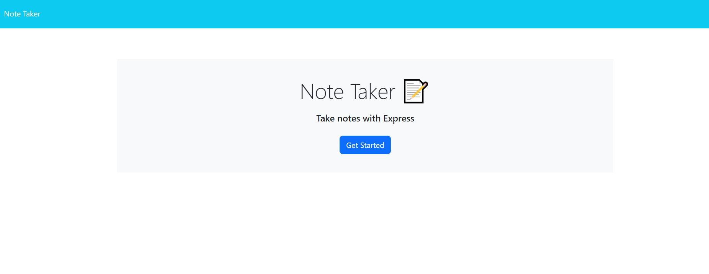
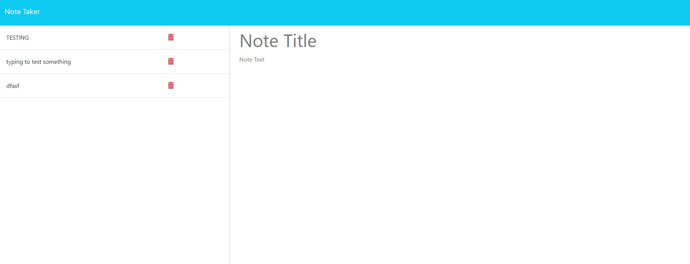
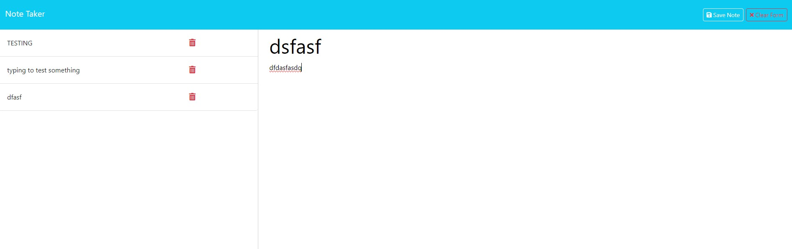

# CHALLENGE 11 NOTE TAKER

## DESCRIPTION
Are you unorganized? Do you need something to help you keep track of things like a grocery list, or need to make a quick reminder? I have designed a quick and easy way to keep track of those things. Easily take notes by using this simple program. Very fast and simple to use.

## HOW TO USE
There are two ways to use this program:

First way to use this program is you must have node installed. To check if you have it installed, open a new terminal, type 'node --version'. If you have it installed, you should see a version number. If you do not have node installed, then head over to 'https://nodejs.org/en/download'. Download the correct node for your operating system and install. After you have node installed, in your VSCode, open a new terminal and clone this program from my GitHub. Once cloned, type 'npm start' to open the program. It should open a browser and look like this:

Next, click on the 'Get Started' button and it should take you to this page:

Finally, once you add a title and some notes, then you will enable the save function and clear form function on the top right. Once saved, they will be displayed on the left side panel.

The second way to use this program is just to enter this URL: <i> https://challenge-11-note-taker-9201751f4d1d.herokuapp.com/ </i> into a web browser and follow the steps above.

## ACCEPTANCE CRITERIA
GIVEN a note-taking application\
WHEN I open the Note Taker\
THEN I am presented with a landing page with a link to a notes page\
WHEN I click on the link to the notes page\
THEN I am presented with a page with existing notes listed in the left-hand column, plus empty fields to enter a new note title and the note’s text in the right-hand column\
WHEN I enter a new note title and the note’s text\
THEN a "Save Note" button and a "Clear Form" button appear in the navigation at the top of the page\
WHEN I click on the Save button\
THEN the new note I have entered is saved and appears in the left-hand column with the other existing notes and the buttons in the navigation disappear\
WHEN I click on an existing note in the list in the left-hand column\
THEN that note appears in the right-hand column and a "New Note" button appears in the navigation\
WHEN I click on the "New Note" button in the navigation at the top of the page\
THEN I am presented with empty fields to enter a new note title and the note’s text in the right-hand column and the button disappears

## VIEWING MY PROJECT
Link to Deployed Application: <i> https://github.com/rapostoljr/challenge_11_note_taker.git </i>\
Link to Deployed Heroku: <i> https://challenge-11-note-taker-9201751f4d1d.herokuapp.com/ </i>